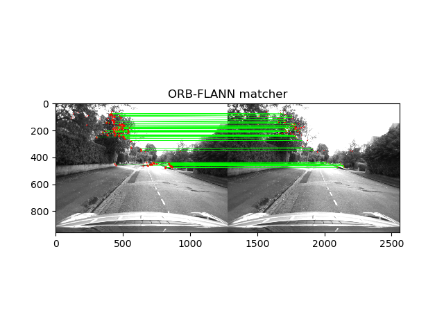
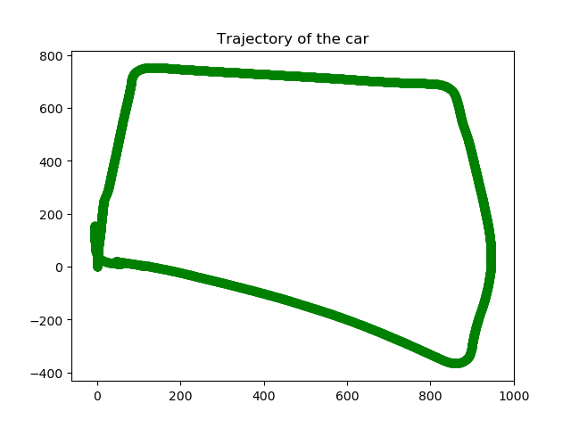

Feature detection:

 	

Camera pose estimation:

 	
	

Dataset (.npy) - 

    https://drive.google.com/file/d/1sJ3NfOpi9GpRE913XT3-L9ipRHenuMMs/view?usp=drivesdk
-------------------------------------------------------------
There are  5 codes attached with one sub-directory 
The codes in .py files are as follows:

read_images.py (data set preperation and conversion of image folder to .npy)

	NOTE: THIS HAS TO BE RUN, OR ELSE, PLEASE DOWNLOAD THE .npy dataset FROM THE GOOGLE DRIVE LINK (),
	SO THAT THE OTHER TWO CODES CAN RUN. THE DATA SET IS 4.4GB  AND HENCE, COULDN'T BE ATTACHED.
	
builtin_structure_motion.py (Code for visual odometry using built in functions)

Original_stereo.py (Code for visual odometry using user defined functions)

Other two codes are supplied with the dataset itself.

ReadCameraModel.py
UndistortImage.py

-------------------------------------------------------------
Directories are:

	PLace a folder called 'Output'. This is where the images will get populated.
	So the third code (Original_stereo.py) will over write the images populated
	by the second code. (builtin_structure_motion.py )
---------------------------------------------------------------
